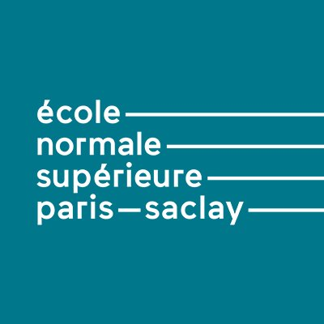

## About Me
I am a final-year Master of Research student in the Mathematics, Vision, Apprentissage (MVA) program at ENS Paris-Saclay, with a focus on machine learning, computer vision, and generative models. My goal is to pursue a Ph.D. in these areas to contribute to cutting-edge research and advancements in artificial intelligence.

## Education
- **ENS Paris-Saclay**
  

    
    

      *Master of Research MVA (2nd year) in Mathematics, Machine Learning, Computer Vision at the MVA*
    

  

- **Sorbonne University**
  

    
    

      <strong>Master's degree in Applied Mathematics</strong>
      <strong>Bachelor's degree in Mathematics</strong>
      <strong>Bachelor's degree in Computer Science</strong>
    

  

  
## Research Interests
- Computer Vision
- Generative AI
- Diffusion Models
- Large Language Models

## Research Experience
- **Text-to-Image Generation Control with IP-Adapter (Project at the MVA)**
  - *On going*
  - Enhancing the creative capabilities of the IP-Adapter model for text-to-image generation.

- **Refining Image Segmentation through Diffusion Models (Project at the MVA)**
  - *2023-2024*
  - Exploring diffusion models for refining image segmentation tasks.

- **Data Challenge for Sketch Drawings Images Classification (Project at the MVA)**
  - *2023*
  - Achieved top submissions in class for classifying sketch drawing images.

## Professional Experience
- **Research Internship (Upcoming)**
  - *April 2024 - September 2024*
  - Undertaking a 6-month research internship to publish a paper at top conferences.

- **Tutoring**
  - *2022-2023*
  - Tutored second-year bachelor's students in topology, differential calculus, and probability.

## Skills
- **Programming Languages and Software:**
  - Python, C, Java, C++
  - NumPy, Pytorch, Pandas, Scikit-learn, OpenCV, Google Cloud

- **Languages:**
  - Fluent in French, Good command of English, Basic understanding of Spanish

## Achievements
- Graduated with High Honors in Master's degree.
- Top 7% in Bachelor's degree, qualifying for a dual degree in Mathematics and Computer Science.
- Admission to renowned institutions such as ENSAE Paris – Institut Polytechnique de Paris and Dauphine PSL.

## Interests and Activities
- Avid chess player
- Music enthusiast
